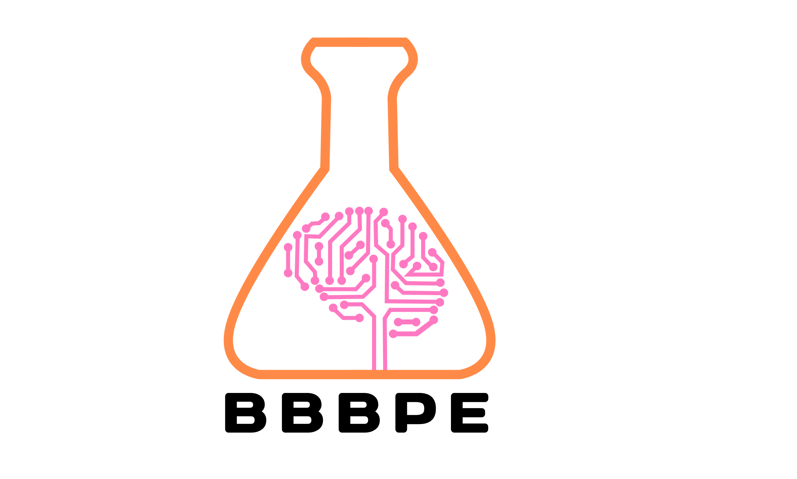

# Princeton-Medihack-BBBPE

B.B.B.P.E (Blood Brain Barrier Penetration Engine) is a web application that leverages modern computational methods for drug discovery. Our platform utilizes deepchem and PyTorch libraries to determine which small molecules and proteins can permeate the Blood Brain Barrier. 
